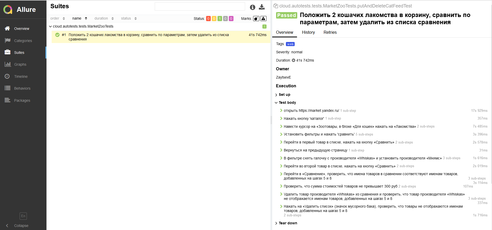

## тестовое здание

[Gradle](src/test/resources/img/icons/Gradle.png)!

Реализованы проверки:

## UI Автотесты на http://yandex.market.ru/

UI

    Открыть https://market.yandex.ru/
    Нажать кнопку 'каталог'
    Навести курсор на «Зоотовары, в блоке «Для кошек» нажать на «Лакомства»
    Установить фильтры и нажать 'сравнить'
    Перейти в первый товар в списке, нажать на кнопку «Сравнить»
    Вернуться на предыдущую страницу
    В фильтре снять галочку с производителя «Whiskas» и установить производителя «Мнямс»
    Перейти во второй товар в списке, нажать на кнопку «Сравнить» 
    Перейти в «Сравнение», проверить, что имена товаров в сравнении соответствуют
    Проверить, что сумма стоимостей товаров не превышает 300 руб
    Удалить товар производителя «Whiskas» из сравнения и проверить, что товар производителя «Whiskas» не отображается
    Нажать на «Удалить список» (значок мусорного бака), проверить, что товары не отображаются 

### Запуск тестов

Локальный запуск:

    gradle clean test

Локальный запуск с количественным параметром запускаемых потоков:

    gradle clean test -Dthreads=5

Удаленный запуск тестов:

    gradle clean test -Ddriver=remote

### Отчёт в Allure Report

